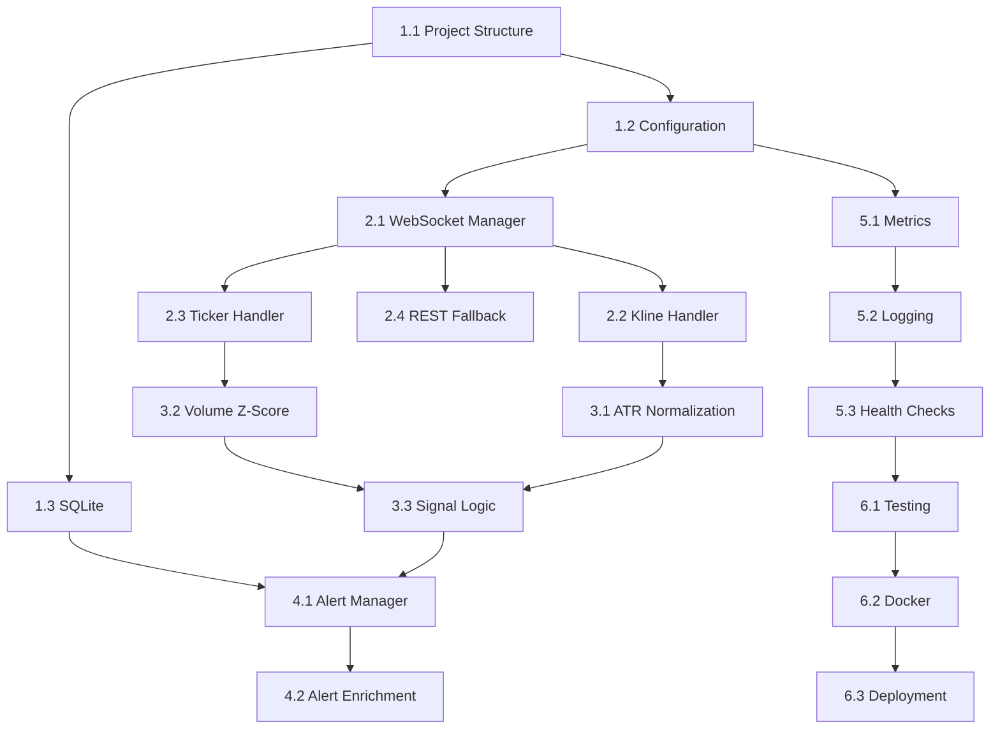

# Binance Momentum Monitor - WebSocket Upgrade Implementation Plan

## Overview
This document provides a step-by-step implementation plan to upgrade the current REST-based momentum monitor to a WebSocket-first architecture with enhanced signal detection capabilities.

## Phase 1: Foundation & Infrastructure (Week 1)

### Task 1.1: Project Structure Refactoring
**Current State**: Single `momentum_monitor.py` file  
**Target State**: Modular architecture with clear separation of concerns

```
binance_momentum_monitor/
├── src/
│   ├── __init__.py
│   ├── core/
│   │   ├── __init__.py
│   │   ├── config.py              # Configuration management
│   │   ├── universe.py            # Symbol universe management
│   │   └── types.py               # Data types/models
│   ├── data/
│   │   ├── __init__.py
│   │   ├── websocket_client.py   # WebSocket connection manager
│   │   ├── rest_client.py         # REST API fallback
│   │   └── cache.py               # Data caching layer
│   ├── signals/
│   │   ├── __init__.py
│   │   ├── momentum.py            # Momentum calculation logic
│   │   ├── normalizers.py         # ATR/Z-score normalization
│   │   └── filters.py             # Signal filtering
│   ├── alerts/
│   │   ├── __init__.py
│   │   ├── manager.py             # Alert orchestration
│   │   ├── discord.py             # Discord integration
│   │   └── deduplication.py       # SQLite dedup logic
│   └── monitoring/
│       ├── __init__.py
│       ├── metrics.py             # Performance metrics
│       └── logger.py              # Structured logging
├── tests/                         # Unit tests
├── docker/
│   ├── Dockerfile
│   └── docker-compose.yml
├── config/
│   └── default.yaml               # Default configuration
└── requirements.txt
```

**Acceptance Criteria**:
- Current functionality preserved in new structure
- All imports working correctly
- Basic unit test structure in place

### Task 1.2: Configuration Management System
**Goal**: Externalize all configuration with environment variable overrides

**Implementation**:
```python
# config.yaml structure
universe:
  cache_ttl: 3600  # 1 hour
  min_hourly_volume: 1000
  
data:
  websocket:
    max_streams_per_connection: 1024
    max_messages_per_second: 10
    reconnect_delay: 5
  rest:
    rate_limit: 1200  # per minute
    
signals:
  timeframe: "15m"
  lookback_periods: 8
  volume_zscore_threshold: 2.0
  price_change_threshold: 0.05
  use_atr_normalization: true
  
alerts:
  cooldown_minutes: 30
  discord_webhook_url: "${DISCORD_WEBHOOK_URL}"
  
monitoring:
  metrics_interval: 60
  log_level: "INFO"
```

**Acceptance Criteria**:
- Configuration loads from YAML with env var interpolation
- Validation on startup
- Hot-reload capability for non-critical settings

### Task 1.3: SQLite Persistence Layer
**Goal**: Implement dedupe database for alerts

**Database Schema**:
```sql
CREATE TABLE alerts (
    id INTEGER PRIMARY KEY AUTOINCREMENT,
    symbol TEXT NOT NULL,
    timeframe TEXT NOT NULL,
    bar_close_time INTEGER NOT NULL,
    signature TEXT NOT NULL,
    created_at TIMESTAMP DEFAULT CURRENT_TIMESTAMP,
    UNIQUE(symbol, timeframe, bar_close_time)
);

CREATE INDEX idx_alerts_symbol_time ON alerts(symbol, bar_close_time);
CREATE INDEX idx_alerts_signature ON alerts(signature);
```

**Implementation Tasks**:
- Create database initialization
- Implement alert storage/retrieval
- Add cleanup for old records (>7 days)
- Handle concurrent access safely

**Acceptance Criteria**:
- Alerts persist across restarts
- No duplicate alerts for same bar
- Automatic old record cleanup

## Phase 2: WebSocket Infrastructure (Week 2)

### Task 2.1: WebSocket Connection Manager
**Goal**: Robust WebSocket client with connection pooling

**Core Features**:
- Connection pool management (multiple connections for >1024 streams)
- Automatic reconnection with exponential backoff
- Stream subscription management
- Message rate limiting (10 msg/sec per connection)
- Health checking and connection state tracking

**Implementation Checklist**:
- [ ] Base WebSocket client using `websockets` library
- [ ] Connection pooling logic
- [ ] Stream-to-connection mapping
- [ ] Reconnection handler with state recovery
- [ ] Message dispatcher to appropriate handlers
- [ ] Connection health monitoring

**Acceptance Criteria**:
- Handles 300+ symbol subscriptions across multiple connections
- Automatic recovery from disconnections
- No message loss during reconnection
- Respects Binance rate limits

### Task 2.2: Kline Stream Handler
**Goal**: Process real-time kline updates

**Stream Format**: `<symbol>@kline_<interval>`

**Implementation**:
- Subscribe to kline streams for all eligible symbols
- Buffer incomplete candles
- Process only when `isFinal=true`
- Maintain rolling window of historical data
- Emit closed bar events for signal processing

**Data Structure**:
```python
@dataclass
class KlineBar:
    symbol: str
    open_time: int
    close_time: int
    open: float
    high: float
    low: float
    close: float
    volume: float
    quote_volume: float
    is_final: bool
```

**Acceptance Criteria**:
- Zero duplicate bar processing
- Handles out-of-order messages
- Memory-efficient historical data storage

### Task 2.3: 24hr Ticker Stream Handler
**Goal**: Maintain real-time liquidity data

**Stream**: `!ticker@arr` (all market tickers)

**Implementation**:
- Subscribe to combined ticker stream
- Update symbol liquidity cache on each message
- Calculate hourly average volume
- Mark symbols as eligible/ineligible based on thresholds

**Acceptance Criteria**:
- Real-time liquidity filtering
- Efficient updates (only changed values)
- Thread-safe cache access

### Task 2.4: REST API Fallback System
**Goal**: Graceful degradation when WebSocket fails

**Scenarios Requiring REST**:
1. Initial startup (bootstrap current state)
2. Post-reconnection gap filling
3. Exchange info updates (hourly)
4. Emergency fallback mode

**Implementation**:
- REST client with connection pooling
- Rate limit tracking
- Request prioritization
- Circuit breaker pattern

**Acceptance Criteria**:
- Seamless REST/WebSocket transitions
- No data gaps during switches
- Rate limit compliance

## Phase 3: Signal Detection Enhancement (Week 3)

### Task 3.1: ATR-Based Normalization
**Goal**: Normalize price movements by volatility

**Implementation**:
```python
# Calculate ATR over lookback period
# Normalize price change: return / ATR
# Dynamic thresholds based on market regime
```

**Components**:
- ATR calculator with configurable period
- Real-time ATR updates from kline data
- Normalized return calculation
- Market regime detection (trending/ranging)

**Acceptance Criteria**:
- ATR updates with each new bar
- Handles symbols with insufficient history
- Configurable normalization parameters

### Task 3.2: Volume Z-Score Implementation
**Goal**: Detect statistically significant volume spikes

**Formula**:
```
z_score = (current_volume - mean_volume) / std_dev_volume
```

**Implementation**:
- Rolling statistics calculator
- Configurable lookback window
- Handle edge cases (low volume, new listings)
- Multi-timeframe volume analysis

**Acceptance Criteria**:
- Z-scores calculated for each closed bar
- Handles symbols with erratic volume
- Performance optimized for 300+ symbols

### Task 3.3: Enhanced Signal Logic
**Goal**: Combine momentum and volume signals intelligently

**Signal Criteria**:
1. Price momentum (ATR-normalized) > threshold
2. Volume z-score > threshold
3. Liquidity check passed
4. No recent alert (cooldown)

**Additional Filters**:
- Trend alignment check
- Spread/slippage estimation
- Correlation filter (avoid multiple correlated alerts)

**Acceptance Criteria**:
- Clear, auditable signal generation
- All thresholds configurable
- Signal metadata for analysis

## Phase 4: Alert System Upgrade (Week 4)

### Task 4.1: Alert Manager Refactoring
**Goal**: Sophisticated alert orchestration

**Features**:
- Priority queue for alerts
- Rate limiting per Discord webhook
- Batch similar alerts
- Alert templating system
- Fallback channels (log file, email)

**Acceptance Criteria**:
- No alert loss under load
- Graceful degradation
- Template customization

### Task 4.2: Alert Enrichment
**Goal**: Provide actionable context in alerts

**Additional Data**:
- Market regime context
- Correlated symbols moving
- Historical success rate for similar setups
- Estimated spread/slippage
- Funding rate (if applicable)

**Format Example**:
```
🚨 MOMENTUM ALERT: BTCUSDT

📊 Signal Strength: 8.5/10
📈 Price Move: +5.2% (2.3σ normalized)
📊 Volume: 850% vs avg (z-score: 3.2)
⏰ Bar Close: 2025-09-30 15:45:00

📋 Context:
• Market: Bullish trend (15m, 1h aligned)
• Correlation: ETHUSDT +4.8%
• Spread: 0.02% (good liquidity)
• Win Rate: 68% (last 50 similar)
```

**Acceptance Criteria**:
- Rich, actionable alerts
- Consistent formatting
- Configurable fields

## Phase 5: Monitoring & Observability (Week 5)

### Task 5.1: Metrics Collection System
**Goal**: Comprehensive performance monitoring

**Key Metrics**:
- **Latency**: Bar close → alert sent
- **Throughput**: Symbols processed/second
- **WebSocket**: Connection health, message rates
- **Signals**: Generated, filtered, alerted
- **System**: CPU, memory, event loop lag

**Implementation**:
- Prometheus-compatible metrics
- Rolling window aggregations
- Percentile tracking (p50, p95, p99)

**Acceptance Criteria**:
- Real-time metric updates
- Historical metric retention
- Export capability

### Task 5.2: Structured Logging
**Goal**: Debuggable, analyzable logs

**Log Structure**:
```json
{
  "timestamp": "2025-09-30T15:45:30.123Z",
  "level": "INFO",
  "component": "signal_processor",
  "event": "momentum_detected",
  "symbol": "BTCUSDT",
  "data": {
    "price_change": 0.052,
    "volume_zscore": 3.2,
    "atr_normalized": 2.3
  },
  "trace_id": "abc123"
}
```

**Acceptance Criteria**:
- JSON structured logs
- Configurable verbosity
- Log rotation handled

### Task 5.3: Health Check System
**Goal**: Self-monitoring and alerting

**Health Checks**:
- WebSocket connection states
- Data freshness per symbol
- Alert delivery success
- Database accessibility
- Memory usage

**Acceptance Criteria**:
- HTTP health endpoint
- Automatic recovery attempts
- Health status in logs

## Phase 6: Testing & Deployment (Week 6)

### Task 6.1: Comprehensive Test Suite
**Test Coverage**:
- Unit tests for each module
- Integration tests for data flow
- Load tests (300+ symbols)
- Failure scenario tests
- End-to-end alert tests

### Task 6.2: Docker Optimization
**Improvements**:
- Multi-stage build
- Non-root user
- Health checks
- Resource limits
- Volume mounts for persistence

### Task 6.3: Deployment Automation
**Components**:
- Environment-specific configs
- Deployment scripts
- Rollback procedures
- Monitoring setup

## Implementation Order & Dependencies



## Risk Mitigation

### Technical Risks
1. **WebSocket Stability**: Implement robust reconnection logic
2. **Memory Leaks**: Regular profiling, bounded buffers
3. **Rate Limits**: Conservative limits, circuit breakers
4. **Data Consistency**: Careful state management

### Operational Risks
1. **Alert Storms**: Rate limiting, batching
2. **False Positives**: Backtesting, parameter tuning
3. **Downtime**: Health checks, auto-recovery

## Success Metrics
- **Latency**: <2s from bar close to alert
- **Reliability**: >99.5% uptime
- **Accuracy**: <20% false positive rate
- **Coverage**: 250+ active symbols monitored
- **Efficiency**: <50% CPU with full load

## Notes for Implementation
1. Start with Phase 1-2 to establish foundation
2. Test each phase thoroughly before proceeding
3. Keep backward compatibility during migration
4. Monitor performance metrics throughout
5. Document all configuration options